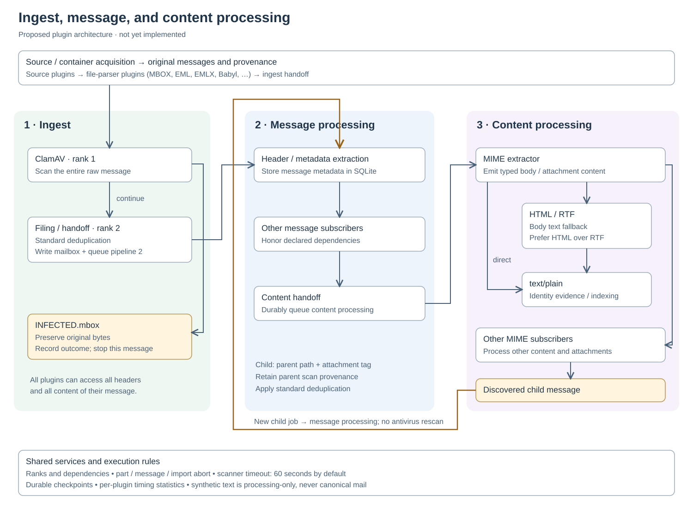

<!-- Copyright (C) 2026 Simson L. Garfinkel. All Rights Reserved. -->

# Plug-ins

## Proposed ranked processing graphs



The same graphic appears on the [website plugin page](../website/content/plugins.md).
This section specifies planned behavior; the implementation described below
still provides source and file-parser plugins only.

Source/container acquisition, including its file-parser subtree, supplies raw
messages to three processing pipelines:

1. **Ingest:** ClamAV runs at rank 1 on the entire raw message. A positive result
   writes through the INFECTED service and aborts downstream processing.
   The filing/handoff plugin runs at rank 2: deduplicate, durably publish the
   original bytes, and queue message processing.
2. **Message processing:** extract headers and store basic metadata in SQLite;
   a handoff plugin then queues content processing. Additional per-message
   subscribers can register independently.
3. **Content processing:** MIME extraction publishes typed body/attachment
   objects to the appropriate subscribers, including identity extraction.

The existing source/file layers precede these pipelines; they have not been
removed or renamed as message processing. Plugins receive one typed processing
object with application services, archive context, immutable content reference,
content type, message/parent-part identity, body/attachment scope, and synthetic
provenance.

Every plugin can access all headers and all content of its current message,
regardless of pipeline or subscribed type. Type and body/attachment selectors
control invocation, not access. Plugins do the work appropriate to their
pipeline. The filing plugin may read whatever it needs after ClamAV, retaining
current date/owner/autosave/deduplication rules; full metadata storage belongs
to message processing.

Dispatch follows a DAG of declared types and dependencies. Subscribers declare
a rank; all work at a rank completes before higher-ranked subscribers for the
same type run. Required cross-type outputs must also precede their consumers.
ClamAV rank 1 and filing/handoff rank 2 are ingest ranks; MIME extraction belongs
to content processing. Abort scopes are part, message, and import. Scanner timeouts default to 60 seconds and are configurable in TOML.
Invocation statistics include count, total time, shortest, longest, average,
errors, and timeouts. About lists registered plugins by subscribed type.

Publication uses a framework service selecting year/role, including the
INFECTED destination, and preserving transactions, locking, byte fidelity and
recovery. Quarantine records minimal message identity/provenance/scan outcome
without requiring header parsing, then stops the message's tree.

TOML declares body-only, attachment-only, or both. Synthetic objects inherit
scope and source provenance and are not published as canonical mail. Missing
plain-text body alternatives are synthesized from HTML preferentially, then
RTF. An unrelated text attachment does not suppress body conversion.

Attached emails become independent first-class message jobs with parent-message
and MIME-part paths. They have local body/attachment scopes and retain an
attachment-origin tag. Content processing submits each discovered child directly
to message processing, bypassing ingest and another antivirus scan. The child
retains the parent's scan provenance rather than claiming an independent scan.
The handoff uses the shared deduplication/publication service to establish the
child record and durable content reference. This is a new job root, not a
back-edge in one message's DAG. Attached and standalone occurrences use the standard normalized Message-ID plus
raw SHA-256 deduplication key, including the current missing-ID fallback. One
canonical message and its extracted metadata are shared; each occurrence has
its own source/provenance record, extended with parent-message and MIME-part
paths. The attachment tag means also observed as an attachment, not exclusively
attached. Child-byte recovery and resource-limit behavior are specified below.
The viewer shows origin paths; the attachment tag initially has a 5% gray background.

On archive opening, unfinished work prompts **Incomplete work**, with checked
**Continue ingest** and **Continue content processing** choices. No persistent
“do not ask again” option suppresses unfinished work. Selecting only content processing runs eligible already-ingested messages even
when ingest remains incomplete; required message-metadata processing precedes
their content jobs. Selecting both completes ingest before deferred content
processing. Unchecking both opens the archive without starting work. Extraction
checkpoints distinguish plugin versions and completed, failed, and pending work;
manual identity decisions survive all extraction and matcher runs.

The full [tag editor is tracked in issue #119](https://github.com/simsong/email-collection-toolkit/issues/119).
Tag definitions have `tagid`, name, background color, text color, crosshatching,
and font; presentation fields permit NULL for no change. Definitions and
assignments are durable, not disposable search-index data.

### Registration and manifest contract

The processor API is a planned versioned extension of the existing trusted
Python plugin system, not a new package installer. Existing source/file API v1
manifests remain supported through adapters. The new processor manifest uses
API version 2 and a `processors/<kind>/plugin.toml` directory beneath packaged
or explicitly trusted plugin roots. These proposed fields are not accepted by
the current loader:

```toml
api_version = 2
plugin_type = "processor"
kind = "identity-evidence"
name = "Identity evidence extraction"
implementation_version = "1"
entrypoint = "plugin:create_plugin"
pipeline = "content"                   # ingest, message, or content
subscribes = ["text/plain"]
emits = ["application/x-mailarchiver-identity-evidence"]
rank = 10
scope = "both"                         # body, attachment, or both
timeout_seconds = 60
requires = []                         # required plugin kinds in this pipeline
```

Rank is a positive integer, independent of source/file recognition priority.
Timeout is a positive duration in seconds, defaulting to 60. Every processor
has a declared scope; raw-message/header invocations use the message's local
body scope. An attached email becomes its own message, with its own body and
attachment scopes and retained attachment-origin provenance.

Validate all manifests before importing plugin code. Reject duplicate kinds,
unknown phases/types of fields, missing required plugins, contradictory rank
dependencies, and cycles within a job graph. Freeze the registry for the run.
Use stable plugin-kind ordering within a rank; equal ranks permit concurrency
but do not promise it. Unsubscribed content is retained, not treated as an error.
The existing explicit trust, module-path confinement and no-archive-discovery
rules remain applicable. Trusted Python plugins are not sandboxed.

### One processing object and typed results

Each processor implements the conceptual interface
`process(item: ProcessingObject) -> ProcessingResult`. Both models and all
nested data records are typed Pydantic structures; arbitrary dictionaries are
not the internal API. Concrete Python classes will be implemented separately.

| Processing object field | Contract |
|---|---|
| `application` | Application/service context; no GUI-thread assumption |
| `archive` | Current archive and its controlled mailbox/catalog services |
| `job_id`, `pipeline` | Durable job identity and current pipeline |
| `message_ref` | Whole raw-message reference, all headers and content accessible |
| `content_ref`, `content_type` | Current immutable stream/reference and dispatch type |
| `part_path`, `scope` | Stable MIME-part path and local body/attachment scope |
| `provenance` | Source occurrence, parent message/path, and scan provenance |
| `synthetic`, `producer` | Derived status and generating plugin/version |
| `cancellation`, `deadline` | Framework cancellation and invocation deadline |

References support bounded streaming; emitting an object does not require
copying a message or attachment into memory. Application/service handles are
runtime capabilities, not serialized job payloads. Durable jobs store stable
references and reconstruct the processing object on resume. Accessors may
parse lazily; creating the raw object must not MIME-parse before ClamAV.

Dispatch uses normalized MIME types without parameters; charset and other MIME
parameters remain in typed content metadata. Framework types are explicitly
namespaced: `application/x-mailarchiver-raw-message`,
`application/x-mailarchiver-message-headers`, and
`application/x-mailarchiver-identity-evidence`. Actual parts retain their MIME
types, including `message/rfc822`. These framework labels are internal types,
not headers added to canonical messages.

A result contains emitted processing objects, typed diagnostics, and one
control outcome: continue, abort part, abort message, or fail import. Publications,
catalog changes and handoff requests use application services rather than
uncoordinated file/database writes. Plugins do not own threads or print reports.

### Dispatch, aborts and failure handling

For each input object/type, finish all subscribers at a rank before releasing
higher-ranked subscribers. Buffer emitted objects until the rank barrier has
resolved; downstream consumers cannot outrun a scanner or another aborting
subscriber. Cross-type required outputs and explicit dependencies also gate
dispatch. The strongest outcome wins: import failure, message abort, part
abort, then continue.

A part abort stops that part and its descendants, allowing unrelated sibling
parts to continue. At a raw-message root it stops that message. A message abort
cancels remaining work for that message; an import failure stops scheduling
new work and retains completed publications and safe checkpoints. Cancellation
of in-flight work must finish before releasing its protected resources.
Separate child-message jobs have their own abort scope once durably submitted.

A positive antivirus result is a handled message abort: commit quarantine and
its observation before stopping downstream work. A scanner error or timeout
is never a clean verdict. Record the failure, retain recoverable input and leave
the work retryable; stop normal filing of that input. Malformed MIME, decoding
failures and unscannable content must never silently discard original bytes.

Timeout enforcement must stop execution, not merely stop waiting on a live
thread that can still write. Framework-owned subprocesses or another mechanism
with equivalent cancellation guarantees are required for noncooperative
scanners. Failed/timed-out invocations cannot publish late outputs.

### Archive services and durable handoffs

The mailbox service accepts a typed destination containing year and role,
including `(2006, Sender)`, `(2006, Archive)`, and `(INFECTED, None)`.
The Sender role maps to the existing Sent archive naming convention. Return a
controlled mailbox handle; publication remains behind the service so plugins
cannot bypass locking, journals, manifests, byte preservation or deduplication.

A publication/handoff operation establishes the message record, canonical
location, occurrence provenance and next-pipeline job together under the
archive's crash-recovery protocol. Never acknowledge source progress with an
unrecoverable gap between publication and queue creation. Replaying a handoff
must find the existing publication/job instead of duplicating either. SQLite
transactions alone do not make MBOX writes atomic; retain journal recovery.

The attached-message service extracts original embedded RFC 5322 bytes after
transfer decoding; it must not serialize a parsed message to invent those
bytes. Record parent message, MIME-part path and the child's SHA-256. When
exact extraction is impossible, retain the parent and diagnostic, leaving child
extraction incomplete rather than fabricating a canonical child. Deduplicate
through the ordinary admission service, add occurrence provenance, and queue
message processing directly. Do not enqueue ingest or ClamAV again. A child's
scan status records inherited provenance, never a fresh scan invocation.

Bound nesting depth, total expanded bytes and child count per root message.
Exceeding a bound records incomplete extraction with a retryable diagnostic;
it does not delete or truncate parent mail. Exact limits are implementation
configuration, not changes to content identity. Job identity and ancestry
checks prevent endlessly rediscovering the same child occurrence.

### Persistent work, identity evidence and manual decisions

Persist job phase, message/part identity, plugin kind/version, relevant
configuration fingerprint, input digest, attempts, status and diagnostics.
Statuses distinguish pending, running, completed, aborted, failed and cancelled.
On restart, abandoned running jobs become retryable; successful unchanged work
is skipped. A plugin/version/configuration change invalidates its derived work
and dependent outputs without rewriting canonical messages or manual decisions.
Synthetic content can be regenerated from its producer and original reference.

The archive-open prompt covers incomplete message jobs as prerequisites of
content processing as well as unfinished ingest. Checkpoint completed work
per plugin and input; pause at safe publication boundaries. A failed prerequisite
blocks dependent work and remains visible rather than being marked complete.
No background run starts merely because a plugin was discovered.

Identity extraction initially supplies signature evidence, including addresses
absent from headers. Store those as unresolved addresses before authoritative
matching; count signature occurrences separately from header message counts.
Group subdomains under their registrable parent domain while keeping public
mail providers distinct from institutional affiliation evidence. Person-to-
institution links retain dated, potentially simultaneous affiliations.
Manual identity edits save immediately and remain authoritative across
extraction and matcher reruns; extracted suggestions retain provenance.

Tags have stable IDs and names, plus nullable background/text colors,
crosshatching and font. NULL means no style override. The initial attachment
tag uses a 5% gray background (`#f2f2f2`); the future editor and multi-tag display
rules are tracked in issue #119. Tag definitions, assignments and manual
decisions need durable backup/recovery beyond rebuilding a search index.

### Statistics, About and implementation acceptance

Use monotonic elapsed time per invocation. Count failures, aborts and timeouts
as invocations; accumulate count, total duration, minimum and maximum. Average
is total/count, or unavailable with no invocations. Reports show zero-count
plugins without misleading duration values. Aggregate safely across workers
and print the report on success, cancellation or handled import failure.

About groups the frozen registered processor list by subscribed MIME/framework
type, showing pipeline, rank, scope, version and timeout. Also show source/file
plugins and explicitly identify their acquisition role. Deferred content work
and scanner failures must be visible in progress/status reporting.

Implementation acceptance must exercise real behavior through Makefile targets:
rank and dependency ordering; each abort scope; timeout cancellation without
late writes; original-byte quarantine; crash/replay between publication and
handoff; content-only resume; attachment deduplication and provenance; nested
message bounds; body versus attachment selection; HTML-before-RTF fallback;
synthetic content exclusion from canonical mail; durable manual edits; and
accurate statistics. Use fixtures and the existing on-demand ClamAV EICAR test.
The diagram and this contract specify intended behavior, not evidence that
these acceptance checks or the new processor implementation already exist.

## Implemented ingest plugins

Email Collection Toolkit currently implements only the two ingest plug-in architectures
described below. They are deliberately separate from the planned geography data
and visualization extension points; an installed ingest plug-in cannot register
a graphical menu or render a visualization.

Email Collection Toolkit has two independent generator plug-in layers:

1. a **source plug-in** enumerates mail containers and streams mail objects from
   a source system; and
2. the built-in local source delegates each recognized filename to a
   **file-parser plug-in**.

Plug-ins do not create threads, render status, scan messages, open the archive
catalog, deduplicate mail, or publish canonical MBOX. The framework owns those
operations. This keeps the same source plug-in usable with one worker or many
workers and with either the terminal dashboard or redirected logging.

The implemented flow is:

```text
packaged + explicitly trusted plug-in directories
    |
    v
validate every plugin.toml, then import code and freeze registries
    |
    v
SourcePlugin.discover(SourceSpec)
    -> MailContainer | ProgressEvent | SkippedInput
    |
    | framework snapshots, deduplicates, verifies stable inventories,
    | and fairly orders concurrency keys
    v
framework integrity plan
    |
    v
SourcePlugin.messages(MailContainer, resume_cursor)
    -> MailObject | ProgressEvent
    |
    | local source delegates to FileParserPlugin.messages(...)
    v
parse -> deduplicate -> ClamAV -> publish -> integrity completion and checkpoint
```

## API v1 framework responsibilities

The framework owns:

* plug-in discovery, manifest validation, deterministic ordering, and registry
  freezing before inventory;
* source selection and rejection of ambiguous matches;
* inventory, the global worker pool, cancellation, and per-source concurrency
  limits;
* status aggregation and all terminal or log output;
* execution and persistence of source-selected integrity controls;
* SHA-256 of each transferred RFC 5322 message, deduplication, and ClamAV
  routing;
* catalog transactions and source-integrity checkpoint commits;
* canonical MBOX publication; and
* the archive format's fixed BagIt, Mailbag, `h1`, `h2`, and `h3` integrity
  controls.

A plug-in is read-only with respect to its source. It yields typed values and
may read its source to produce those values. It must not print, start workers,
or write to the archive.

## API v1 versioned contracts

The public API is in `mailarchiver.plugin_api` and currently has API version 1.
All boundary values are immutable Pydantic models with unknown fields rejected.
The principal models are:

* `PluginManifest` and `PluginCapabilities`;
* `SourceSpec`, `SourceReference`, and `FileProbe`;
* `MailContainer`, `MailObject`, `ProgressEvent`, and `SkippedInput`;
* `IntegrityDecision` and `IntegrityEvidence`; and
* `ArchiveReference`.

`MailContainer` is a bounded scheduling and recovery unit. It contains a stable
`work_id`, a source reference, optional message and byte estimates, a
`concurrency_key`, and optional `plugin_data_json`. The last field is private to
the plug-in and must contain only a plug-in-specific Pydantic model serialized
as JSON. It must never contain credentials. A work ID is stable within its
source account; the framework scopes it by plug-in kind and source ID.

`SourceReference.provenance_json` may carry a source-specific Pydantic model
containing non-secret provider provenance. The framework stores it with the
source container; access tokens and credentials are forbidden.

`MailObject` is one streamed message. `raw` is the provider's original RFC 5322
representation. `work_id` binds it to its container, while `cursor` is an
opaque source-native record locator. Optional message and byte fields report
progress without coupling the generator to the status display. The framework
stores the opaque cursor and, when it is numeric, also stores a sortable source
position. A provider may supply a message-specific `source_date_utc` only as a
fallback when neither `Date:` nor `Received:` resolves a date. The typed field
must be timezone-aware and is normalized to UTC; when used, the catalog records
`date_source='source-fallback'`. Header consensus takes precedence over this
field; the previous-message and local path-year fallbacks follow it. The
framework applies the ingest run's configured earliest plausible year to every
candidate date regardless of its source.

`ProgressEvent` is data, not output. The framework sanitizes and renders its
phase and byte or message progress in the assigned worker row. Unknown-byte
sources use completed-container counts for overall percentage. A `SkippedInput`
similarly identifies an unrecognized item; the framework prints each skipped
path and reason once.

## Source plug-in contract

A source plug-in implements:

```python
class SourcePlugin(ABC):
    capabilities: PluginCapabilities
    integrity_controls: SourceIntegrityControls

    def recognizes(self, source: SourceSpec) -> bool: ...

    def discover(
        self, source: SourceSpec
    ) -> Iterator[MailContainer | ProgressEvent | SkippedInput]: ...

    def messages(
        self, container: MailContainer, resume_cursor: str | None
    ) -> Iterator[MailObject | ProgressEvent]: ...
```

The framework requires exactly one source plug-in to recognize each command-line
source. It writes discovery output to a temporary SQLite work snapshot before
ClamAV or archive publication. Duplicate `(plugin kind, source ID, work ID)`
containers are scheduled once; conflicting definitions are fatal.

For `stable_inventory=True`, the framework calls `discover()` a second time and
compares the complete container definitions before starting workers. For
`stable_inventory=False`, it calls `discover()` exactly once and processes that
captured worklist even if the live provider changes afterward. The snapshot is
read in round-robin concurrency-key order so a long account inventory cannot
hide later accounts behind its own limit.

`PluginCapabilities.max_concurrency` is enforced by the framework for each
container's `concurrency_key`; a plug-in never owns a private thread pool. For
example, a provider can use an account ID as the key so several accounts run in
parallel while requests to one account remain bounded.

One source-plug-in instance and its integrity-control instance are shared by all
framework workers. `messages()` and integrity-control methods must therefore be
reentrant or protect mutable provider-client state. The framework rejects a
`resume` decision unless `resumable=True` and a cursor is present.

## Local source and file parsers

The production `file-folder` source recursively walks local files in sorted
directory and filename order. It probes each regular file against the frozen
file registry. No match yields a `SkippedInput`. Multiple packaged matches are
resolved by manifest priority; any overlap involving an external plug-in is a
fatal ambiguity. Known incomplete or malformed formats remain fatal rather than
being reported as harmless skips. Exact-basename `Info.plist` and
`table_of_contents` plus case-insensitive `.toc` mailbox metadata are silently
omitted before recognition.

For every match, the source yields a `MailContainer` holding an opaque serialized
`LocalContainerData`. When a worker consumes it, the local source calls the
selected file parser and converts its records to source-neutral `MailObject`
values.

Recognition receives the filename in `FileProbe`; record generation receives
the resulting `MailContainer` rather than a second bare filename. That small
difference from a filename-only interface keeps the framework-selected source
identity, provenance, estimates, and integrity boundary attached to the work,
and lets the same scheduler handle local files and virtual provider containers.

The packaged file parsers are:

| Kind | Recognition | Behavior |
|---|---|---|
| `emlx` | `.emlx` suffix | Reads the declared RFC 5322 length; rejects partial EMLX |
| `babyl` | case-insensitive `BABYL OPTIONS:` signature | Streams Emacs RMAIL Babyl records, including extensionless files |
| `mbox` | initial `From ` separator | Streams MBOX records with numeric offsets and safe append resume |
| `message` | `.eml` suffix or a direct `cur`/`new` child in a `cur`/`new`/`tmp` Maildir, after higher-priority packaged formats | Streams one RFC 5322 message |

Packaged precedence is EMLX, Babyl, MBOX, then `message`. In particular, an
MBOX envelope signature wins when a one-message MBOX file resides under a
Maildir `cur` or `new` directory. Any overlap involving an external file
plug-in remains a fatal ambiguity.

Babyl parsing handles LF and CRLF containers, uses the original-header block
when present, falls back to visible headers when needed, and omits Babyl labels
and redundant visible-header metadata from the yielded message. A `0x1f` end
marker before the first record represents a valid empty mailbox. It never
changes the source file.

The older `FileParser`, `SourceFile`, `SourceMessage`, and explicit registration
functions remain as a compatibility facade for the built-in physical parsers
and direct tests. Production discovery is manifest-driven and frozen before
workers start.

## Integrity controls

Integrity has three distinct layers.

### Source integrity

Every source plug-in supplies `SourceIntegrityControls`:

```python
class SourceIntegrityControls(ABC):
    control_id: str

    def plan(
        self,
        container: MailContainer,
        prior: tuple[IntegrityEvidence, ...],
    ) -> Iterator[IntegrityDecision | IntegrityEvidence | ProgressEvent]: ...

    def complete(
        self,
        container: MailContainer,
        planned: tuple[IntegrityEvidence, ...],
    ) -> Iterator[IntegrityEvidence | ProgressEvent]: ...
```

Planning emits exactly one `read`, `skip`, or `resume` decision. The framework
records the attempt before message processing and marks it complete only after
`complete()` succeeds. A failed attempt therefore cannot replace the last safe
checkpoint. Evidence is stored in `source_integrity_checks` and
`source_integrity_evidence`; cryptographic evidence must name its algorithm,
while provider version tokens, immutable identifiers, cursors, and metadata
must not claim a hash algorithm.

The framework consumes `complete()` outside the publication lock, forwarding
each `ProgressEvent` as it is yielded. This permits source hashing or provider
I/O to proceed independently across workers. After the generator finishes and
its evidence is validated, the framework acquires the publication lock only to
persist the final evidence and completed checkpoint atomically.

The local source control calculates complete and prefix SHA-256 evidence. A
matching complete digest skips an unchanged file. A grown MBOX resumes only
when the old-length prefix digest matches and the next bytes form an MBOX
message boundary. Truncated files, changed files, unsafe appends, Babyl, EMLX,
and single-message files are fully read. Completion checks the discovered file
size and nanosecond modification time before committing evidence.

Provider controls use provider semantics. Gmail history IDs, IMAP UIDVALIDITY
and UIDs, and Microsoft Graph ETags, change keys, or delta links are version or
cursor evidence—not cryptographic fixity.

API version 1 commits provider integrity evidence only after the whole bounded
container completes. It does not advertise or silently discard per-message
checkpoints. Provider containers must therefore be replayable and reasonably
bounded; interruption re-reads the incomplete container and normal
deduplication handles already committed messages.

### Message-transfer integrity

The framework computes SHA-256 over every `MailObject.raw`, stores it on the
source observation, and uses `(Message-ID, SHA-256)` for deduplication. This
binds a source record to the archived message but does not replace a container
or provider integrity control.

### Archive integrity

Source plug-ins cannot select, weaken, or disable archive integrity controls.
`MailbagArchiveIntegrityControls` wraps the current archive implementation. It
initializes BagIt declarations and the standalone verifier, publishes the
Mailbag metadata and payload/tag manifests after canonical MBOX publication,
and exposes independent verification. The canonical `h1` complete-MBOX, `h2`
recovered-message, and `h3` semantic-message controls are described in
[INTEGRITY_CONTROLS.md](INTEGRITY_CONTROLS.md).

## Directory discovery

Packaged plug-ins live below:

```text
mailarchiver/plugins/
  sources/<kind>/plugin.toml
  files/<kind>/plugin.toml
```

Additional roots are loaded only when explicitly named with repeatable
`ingest --plugin-dir DIRECTORY` options. Each such root has the same `sources/`
and `files/` layout. Mail source trees, the current directory, environment
variables, and the archive directory are never searched implicitly.

Directory membership authorizes Python code execution. Only use
`--plugin-dir` for code you trust.

A manifest contains:

```toml
api_version = 1
plugin_type = "source"       # or "file"
kind = "example"
name = "Example source"
implementation_version = "1"
priority = 100
entrypoint = "plugin:create_plugin"
```

For external plug-ins the entry module must resolve inside that plug-in's own
directory. Absolute paths, `..`, escaping symlinks, missing modules, invalid
API versions, type/directory mismatches, and duplicate `(plugin_type, kind)`
pairs are rejected. All manifests are parsed and validated before any external
module is imported, so one invalid manifest prevents all dynamic code execution
for that startup.

After validation, candidates are sorted by `(priority, kind)`. File plug-ins
are instantiated first. Source factories may accept a read-only `PluginContext`
containing the frozen file registry, which is how the local source delegates to
directory-discovered file parsers. Zero-argument factories are also supported.
The completed source and file registries are immutable.

## Built-in source status

| Kind | Status |
|---|---|
| `file-folder` | production |
| `gmail` | reserved stub; no account access |
| `imap` | reserved stub; no server access |
| `o365` | reserved stub; no Microsoft Graph access |
| `microsoft-exchange` | reserved stub; no Exchange access |
| `stdin` | reserved stub; intended for NUL-delimited records |

The reserved plug-ins recognize their explicit URI schemes and fail clearly.
They do not imply that remote or stream ingest works. A production adapter must
retrieve original raw MIME, define stable source identities and hierarchy,
implement provider-appropriate container integrity and resume evidence, and
pass provider-local integration tests.

The generic provider path itself is implemented and tested: a dynamically
loaded source can emit a virtual container and opaque cursor, use a provider
version-token control, run through the framework worker/status/ClamAV/archive
pipeline, and skip the unchanged container on a later run.

## Catalog representation

The catalog retains the historical table names `source_volumes` and
`source_files`, but they represent source origins and containers. A local row
has `path_kind='file'`; a provider row has `path_kind='provider'`.
`source_plugin`, source-scoped `work_id`, the source-native path or ID,
per-container display/hierarchy/provenance metadata, and the opaque observation
cursor preserve enough information to interpret provenance without reopening
the source. `hierarchy_path` drives mailbox-tree filtering. Opaque cursors have
a nullable numeric projection, so a provider cursor is not confused with byte
offset zero. Provider credentials are never catalog metadata.

Source integrity attempts and their ordered typed evidence are append-only per
run. `source_files.sha256`, `checked_at`, and `completed_run` remain local
display/cache fields; skip and resume decisions use only the most recent
completed typed integrity check.

## Planned geography data providers

Geography refresh is a data-installation pipeline, not an ingest plug-in. It
will download versioned bulk reference datasets, validate their manifests, and
atomically replace the per-user geography database. Its sources include US ZCTA
geography and university main-campus/domain data. It does not submit contact
data to a public lookup service. An optional archive snapshot is an explicit
copy/read choice and remains under archive migration control. The data-provider
interface has not yet been defined; it must not be represented as API v1.

## Planned visualization plug-ins

Visualization plug-ins are a third, future architecture, separate from source
and file-parser plug-ins. The initial API is intentionally limited:

* a plug-in may register one or more host menu entries;
* the host supplies controlled, read-only access to the selected archive
  database;
* the host supplies a visualization canvas or window; and
* a visualization may export HTML or PDF.

It will not initially offer arbitrary user-interface extensions, credentials,
source-mail mutation, or unrestricted archive writes. The API version,
manifest shape, database capability boundary, canvas lifecycle, and export
contract remain to be designed in [issue #81](https://github.com/simsong/email-collection-toolkit/issues/81).
Until then, no visualization plug-in directory or manifest is supported.
