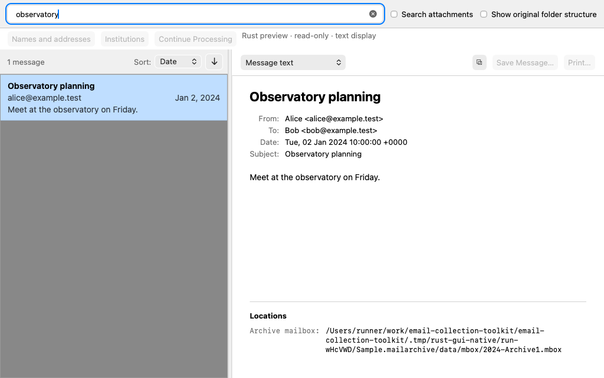

<!-- Copyright (C) 2026 Simson L. Garfinkel. All Rights Reserved. -->

# Rust reader experiment

The default shell hosts the existing HTML/CSS/JavaScript interface in a Rust-owned
Wry/Tao window. Search and verified MIME reads run in Rust. The migration build
also starts a supervised Python archive-service helper for explicit import,
recovery, owner-rule and identity workflows, without loading the Python GUI.
See [current migration status and remaining gates](RUST_GUI_MIGRATION.md).

The earlier egui prototype remains available with `make rust-gui-egui` for
comparison. `make rust-gui` now opens the familiar production-style interface.
Close the old prototype and rerun the command to try the new shell.

Continue Windows implementation with [WINDOWS_RUST_HANDOFF.md](WINDOWS_RUST_HANDOFF.md),
which records the architecture, native-shell boundary, validation commands,
preservation constraints, and remaining work toward full macOS feature parity.

## Try it

From the repository root, using Rust 1.95 or newer:

```sh
make rust-gui ARCHIVE="/path/to/existing/archive"
```

Or use the purpose-made synthetic fixture:

```sh
make rust-gui-demo
make rust-gui ARCHIVE=".tmp/rust-gui-demo"
```

The fixture already created during development can be reused with the second
command. Creation deliberately refuses to overwrite any existing directory.
`RUST_GUI_DEMO` can select a different new fixture path.

Search for `observatory`, then select **Observatory planning** or **Café notes**.
Search for `roses` and select **Garden update** to try sanitized rich HTML.
An empty query shows search help. Choose the archive using `ARCHIVE`, File → Open or Open Recent. Close the window or use Command-Q to exit. No installation is needed.

## Scope

The [migration table](RUST_GUI_MIGRATION.md) lists current controls, the temporary
Python dependency and remaining platform/release work. Rust search retains two
512-entry preview windows, a comprehensive background query, cancellation and
512-row display pages. It preserves archive bytes during reading and rejects
WAL-mode databases. Explicit native Open can request existing lease-protected
hot-journal recovery through the helper. The retained egui comparison executable
keeps its earlier read-only, text-display and search limits.

## Validate without windows

```sh
make test-rust-gui
make test-rust-gui-interop
make test-rust-webview
make test-rust-engine
make rust-gui-smoke ARCHIVE=".tmp/rust-gui-demo" QUERY=observatory
```

The first target drives Search and result selection through headless egui
widgets and the real worker. The second verifies a Python-created archive and
checks every file's bytes remain identical. The smoke command prints the first
selected message through the same worker, so use synthetic mail when recording
logs. These checks do not establish native window appearance or platform parity.
`make test-rust-webview` drives the original page against the actual Rust
backend in headless Chromium and records `.tmp/rust-gui-existing-interface.png`.
`make test-rust-gui-native` builds a synthetic `.mailarchive` through the CLI
and checks startup, a simple search, selection, decoded body, and a native
WKWebView screenshot in a visible window. Its Rust-owned test retains logs,
hashes and the archive under `RUST_GUI_ARTIFACT_DIR` (default
`.tmp/rust-gui-native`). CI runs it in the macos-latest matrix job and uploads
the evidence; broader native interaction and platform parity still need trials.
`make rust-gui`, `make rust-gui-egui`, and the native smoke test launch visible
apps; the headless checks do not.

<details>
<summary>Native Rust GUI screenshot — macos-latest CI, ae69d75</summary>



Captured by [CI run 37232804538](https://github.com/simsong/email-collection-toolkit/actions/runs/37232804538/job/111525888410)
from commit `ae69d7546ed4f55e492d6628cde922c088d7ce9e`. This is a retained
snapshot of that run, not an automatically refreshed image. The full artifact
also contains the CLI-built synthetic archive, verifier logs and hash inventory.

</details>
